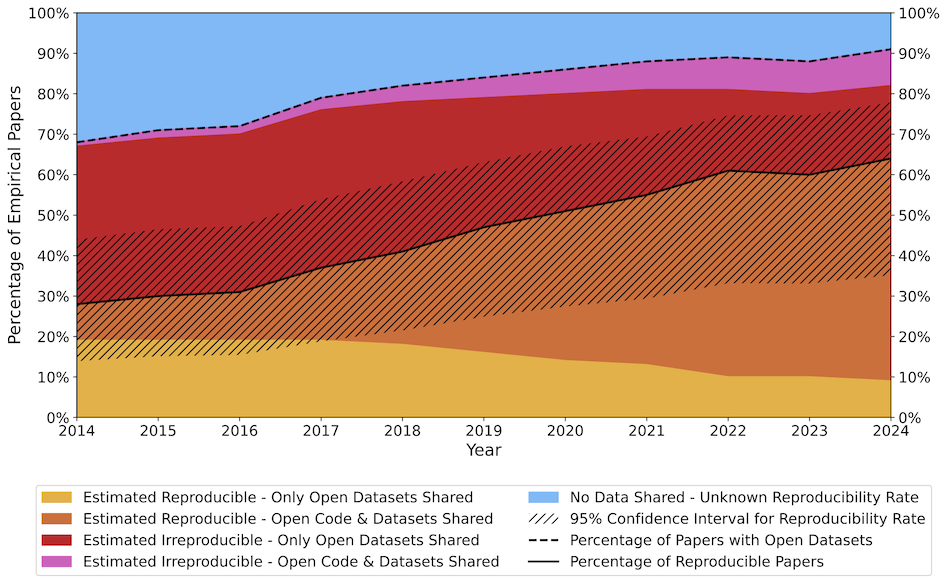

# The Shift Toward Open and Reproducible AI Research


### Estimated reproducibility rate of empirical AI papers from 2014 to 2024.



---

This repository contains the code, prompts, and results for the paper *AI Research moves towards open and reproducible science*, which evaluates reproducibility variables across AI research papers from five major conferences (AAAI, ICLR, ICML, IJCAI, NeurIPS) from 2014 to 2024 using large language models.

---

## Data Availability

Raw paper PDFs and processed text files are **not distributed** in this repository due to potential copyright issues with redistributing the text of academic papers. You have two options:

- **Contact the authors** for a copy of the raw or processed data.
- **Re-run Steps 1 and 2** below to collect and process the data yourself. This should take a few hours.

Pre-computed results from the LLM evaluation are included in `results/` so that the analysis notebooks (Steps 4–8) can be run without re-running the full pipeline.

---

## Reproducing the Results

### Experiment Pipeline

#### Step 1 — Collect Raw Data (PDFs)

**Directory:** [`code/ai_paper_downloader/`](code/ai_paper_downloader/)

Downloads AI research papers from AAAI, ICLR, ICML, IJCAI, and NeurIPS (2014–2024). See the directory README for setup and usage instructions.

- **Input:** Conference name and year
- **Output:** PDFs saved to a local directory

#### Step 2 — Process PDFs to Text

**Directory:** [`code/pdf_to_text/`](code/pdf_to_text/)

Converts the downloaded PDFs to plain text for LLM inference. See the directory README for setup and usage instructions.

- **Input:** PDFs from Step 1
- **Output:** Plain text files

#### Step 3 — Run LLM Evaluation

**Directory:** [`code/llm_evaluate/`](code/llm_evaluate/)

Evaluates each paper's reproducibility variables using an LLM (Claude, ChatGPT, Gemini, or Ollama are all supported). See the directory README for configuration and usage instructions.

- **Input:** Text files from Step 2 and paper lists from `paper_lists/llm_evaluate/`
- **Output:** JSON result files written to `results/experiment/raw_data/`

---

### Postprocessing

#### Step 4 — Process Raw Results

**Directory:** [`notebooks/raw_data/`](notebooks/raw_data/)

Aggregates the raw JSON outputs from Step 3 into CSV files for analysis and verifies that all papers were evaluated.

- **Input:** `results/experiment/raw_data/`
- **Output:** `results/experiment/llm_results.csv`

---

### Analysis and Figures

The following notebooks can be run independently using the pre-computed results in `results/`.

#### Step 5 — Paper Count (Figure 1)

**Directory:** [`notebooks/paper_count/`](notebooks/paper_count/)

Generates Figure 1, showing the number of papers downloaded from each conference per year.

#### Step 6 — LLM Evaluation Results and Paper Figures

**Directory:** [`notebooks/results/`](notebooks/results/)

Analyzes the LLM evaluation results and generates the main figures for the paper.

- **Input:** `results/experiment/llm_results.csv`

#### Step 7 — SOTA / Prompt Optimization Analysis

**Directory:** [`notebooks/SOTA/`](notebooks/SOTA/)

Analyzes the LLM evaluation against the Gundersen and Kjensmo (2018) ground truth dataset (the prompt optimization dataset).

- **Input:** `results/prompt_optimization/`, `gundersen_2018/`

#### Step 8 — Test Set (LLM vs. Human Annotation)

**Directory:** [`notebooks/test_set/`](notebooks/test_set/)

Compares LLM evaluation against human annotation on a random sample from the full dataset.

- **Input:** `results/evaluation/`

---

## Repository Structure

```
the-embrace-of-open-science/
├── code/
│   ├── ai_paper_downloader/   # Step 1: download PDFs
│   ├── pdf_to_text/           # Step 2: convert PDFs to text
│   └── llm_evaluate/          # Step 3: run LLM evaluation
├── paper_lists/
│   ├── downloaded_papers/     # CSV lists of papers by conference/year
│   ├── excluded_papers/       # Papers excluded from analysis
│   └── llm_evaluate/          # Paper batches used as input to Step 3
├── prompts/                   # System prompt and reproducibility questions sent to the LLM
├── gundersen_2018/            # Ground truth for prompt optimization (Gundersen & Kjensmo 2018)
├── notebooks/
│   ├── raw_data/              # Step 4: postprocessing
│   ├── paper_count/           # Step 5: Figure 1
│   ├── results/               # Step 6: main analysis and figures
│   ├── SOTA/                  # Step 7: prompt optimization analysis
│   └── test_set/              # Step 8: LLM vs. human annotation
└── results/
    ├── experiment/            # Full conference dataset results
    ├── evaluation/            # LLM vs. human annotation results
    └── prompt_optimization/   # Prompt optimization results (5 runs)
```

---

## Note on Reproducibility Variable Naming

To maintain consistency with the prompt optimization dataset, reproducibility variable names follow the convention used in Gundersen and Kjensmo (2018). In all results and analysis files:

- The `train` JSON key / CSV column refers to the `open_source_code` reproducibility variable.
- The `validation` JSON key / CSV column refers to the `dataset_splits` reproducibility variable.

---

## Contact

To request a copy of the raw or processed data, please contact the authors.
